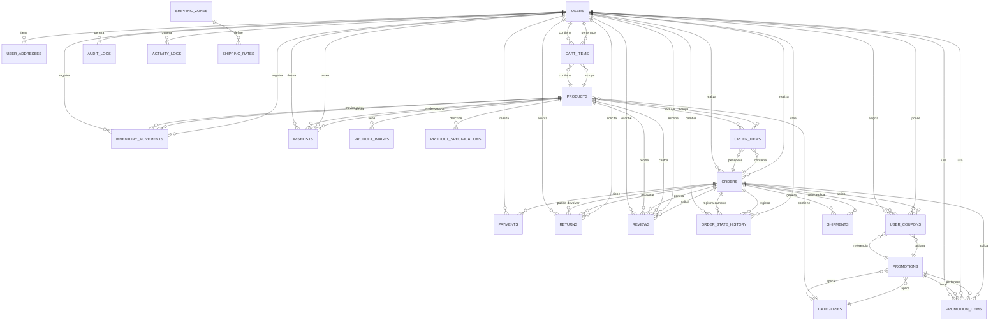

# Base de Datos - IND_MAAV E-Commerce

**Motor:** PostgreSQL 13+  
**Codificación:** UTF-8  
**Versión del Schema:** 2.0

---

## Tabla de Contenidos

1. [Descripción General](#descripción-general)
2. [Tablas](#tablas)
3. [Relaciones](#relaciones)
4. [Índices](#índices)
5. [Diagrama ER](#diagrama-er)
6. [Scripts de Creación](#scripts-de-creación)

---

## Descripción General

La base de datos está organizada en los siguientes módulos:

| Módulo | Tablas | Descripción |
|--------|--------|-------------|
| **Usuarios** | users, user_addresses | Gestión de usuarios y direcciones |
| **Productos** | products, categories, product_images, product_specifications | Catálogo de productos |
| **Carrito** | cart_items | Carrito de compras |
| **Órdenes** | orders, order_items, order_state_history | Gestión de pedidos y cambios de estado |
| **Pagos** | payments | Registro de pagos |
| **Devoluciones** | returns | Gestión de devoluciones (Ley 1480) |
| **Reseñas** | reviews | Calificaciones y comentarios de productos |
| **Envíos** | shipping_zones, shipping_rates, shipments | Gestión de envíos |
| **Promociones** | promotions, promotion_items, user_coupons | Códigos y descuentos |
| **Inventario** | inventory_movements | Auditoría de movimientos de stock |
| **Favoritos** | wishlists | Lista de deseos de usuarios |
| **Auditoría** | audit_logs, activity_logs | Registros de cambios |

---

## Tablas

### 1. users

Almacena la información de los usuarios registrados.

```sql
CREATE TABLE users (
    id UUID PRIMARY KEY DEFAULT gen_random_uuid(),
    nombre VARCHAR(255) NOT NULL,
    email VARCHAR(255) NOT NULL UNIQUE,
    password_hash VARCHAR(255) NOT NULL,
    telefono VARCHAR(20),
    movil VARCHAR(20),
    ubicacion_fisica VARCHAR(255),
    rol ENUM('customer', 'admin', 'vendor') DEFAULT 'customer',
    estado ENUM('activo', 'inactivo', 'bloqueado') DEFAULT 'activo',
    email_verificado BOOLEAN DEFAULT FALSE,
    email_verificado_en TIMESTAMP,
    ultimo_login TIMESTAMP,
    token_reset_password VARCHAR(255),
    token_reset_expira TIMESTAMP,
    creado_en TIMESTAMP NOT NULL DEFAULT CURRENT_TIMESTAMP,
    actualizado_en TIMESTAMP NOT NULL DEFAULT CURRENT_TIMESTAMP,
    eliminado_en TIMESTAMP
);

CREATE INDEX idx_users_email ON users(email);
CREATE INDEX idx_users_rol ON users(rol);
CREATE INDEX idx_users_estado ON users(estado);
CREATE INDEX idx_users_creado_en ON users(creado_en);
```

---

### 2. user_addresses

Almacena las direcciones de envío de los usuarios.

```sql
CREATE TABLE user_addresses (
    id UUID PRIMARY KEY DEFAULT gen_random_uuid(),
    usuario_id UUID NOT NULL REFERENCES users(id) ON DELETE CASCADE,
    tipo ENUM('envio', 'facturacion', 'otro') DEFAULT 'envio',
    nombre_direccion VARCHAR(255),
    direccion VARCHAR(255) NOT NULL,
    ciudad VARCHAR(100) NOT NULL,
    departamento VARCHAR(100) NOT NULL,
    codigo_postal VARCHAR(20),
    pais VARCHAR(100) DEFAULT 'Colombia',
    es_default BOOLEAN DEFAULT FALSE,
    notas TEXT,
    creado_en TIMESTAMP NOT NULL DEFAULT CURRENT_TIMESTAMP,
    actualizado_en TIMESTAMP NOT NULL DEFAULT CURRENT_TIMESTAMP
);

CREATE INDEX idx_user_addresses_usuario_id ON user_addresses(usuario_id);
CREATE INDEX idx_user_addresses_tipo ON user_addresses(tipo);
```

---

### 3. categories

Almacena las categorías de productos.

```sql
CREATE TABLE categories (
    id SERIAL PRIMARY KEY,
    nombre VARCHAR(255) NOT NULL UNIQUE,
    slug VARCHAR(255) NOT NULL UNIQUE,
    descripcion TEXT,
    icono VARCHAR(100),
    imagen VARCHAR(500),
    categoria_padre_id INTEGER REFERENCES categories(id) ON DELETE CASCADE,
    orden INTEGER DEFAULT 0,
    estado ENUM('activa', 'inactiva') DEFAULT 'activa',
    creado_en TIMESTAMP NOT NULL DEFAULT CURRENT_TIMESTAMP,
    actualizado_en TIMESTAMP NOT NULL DEFAULT CURRENT_TIMESTAMP
);

CREATE INDEX idx_categories_slug ON categories(slug);
CREATE INDEX idx_categories_categoria_padre_id ON categories(categoria_padre_id);
CREATE INDEX idx_categories_orden ON categories(orden);
```

---

### 4. products

Almacena la información de productos.

```sql
CREATE TABLE products (
    id SERIAL PRIMARY KEY,
    nombre VARCHAR(255) NOT NULL,
    slug VARCHAR(255) NOT NULL UNIQUE,
    descripcion TEXT NOT NULL,
    descripcion_detallada LONGTEXT,
    categoria_id INTEGER NOT NULL REFERENCES categories(id) ON DELETE CASCADE,
    marca VARCHAR(100),
    sku VARCHAR(100) NOT NULL UNIQUE,
    precio NUMERIC(12, 2) NOT NULL,
    precio_original NUMERIC(12, 2),
    cantidad_disponible INTEGER NOT NULL DEFAULT 0,
    cantidad_minima_compra INTEGER DEFAULT 1,
    calificacion_promedio NUMERIC(3, 2) DEFAULT 0,
    numero_resenas INTEGER DEFAULT 0,
    estado ENUM('activo', 'inactivo', 'descontinuado') DEFAULT 'activo',
    visible_publico BOOLEAN DEFAULT TRUE,
    peso_kg NUMERIC(8, 3),
    dimensiones_ancho_mm INTEGER,
    dimensiones_profundidad_mm INTEGER,
    dimensiones_alto_mm INTEGER,
    material VARCHAR(255),
    acabado VARCHAR(255),
    creado_en TIMESTAMP NOT NULL DEFAULT CURRENT_TIMESTAMP,
    actualizado_en TIMESTAMP NOT NULL DEFAULT CURRENT_TIMESTAMP,
    eliminado_en TIMESTAMP
);

CREATE INDEX idx_products_slug ON products(slug);
CREATE INDEX idx_products_categoria_id ON products(categoria_id);
CREATE INDEX idx_products_sku ON products(sku);
CREATE INDEX idx_products_estado ON products(estado);
CREATE INDEX idx_products_creado_en ON products(creado_en);
```

---

### 5. product_images

Almacena imágenes de productos.

```sql
CREATE TABLE product_images (
    id SERIAL PRIMARY KEY,
    producto_id INTEGER NOT NULL REFERENCES products(id) ON DELETE CASCADE,
    url VARCHAR(500) NOT NULL,
    es_principal BOOLEAN DEFAULT FALSE,
    orden INTEGER DEFAULT 0,
    alt_text VARCHAR(255),
    creado_en TIMESTAMP NOT NULL DEFAULT CURRENT_TIMESTAMP
);

CREATE INDEX idx_product_images_producto_id ON product_images(producto_id);
CREATE INDEX idx_product_images_es_principal ON product_images(es_principal);
```

---

### 6. product_specifications

Almacena especificaciones de productos.

```sql
CREATE TABLE product_specifications (
    id SERIAL PRIMARY KEY,
    producto_id INTEGER NOT NULL REFERENCES products(id) ON DELETE CASCADE,
    nombre_especificacion VARCHAR(255) NOT NULL,
    valor_especificacion VARCHAR(500) NOT NULL,
    orden INTEGER DEFAULT 0
);

CREATE INDEX idx_product_specifications_producto_id ON product_specifications(producto_id);
```

---

### 7. cart_items

Almacena items del carrito de compras.

```sql
CREATE TABLE cart_items (
    id UUID PRIMARY KEY DEFAULT gen_random_uuid(),
    usuario_id UUID NOT NULL REFERENCES users(id) ON DELETE CASCADE,
    producto_id INTEGER NOT NULL REFERENCES products(id) ON DELETE CASCADE,
    cantidad INTEGER NOT NULL CHECK (cantidad > 0),
    precio_snapshot NUMERIC(12, 2) NOT NULL,
    creado_en TIMESTAMP NOT NULL DEFAULT CURRENT_TIMESTAMP,
    actualizado_en TIMESTAMP NOT NULL DEFAULT CURRENT_TIMESTAMP,
    UNIQUE(usuario_id, producto_id)
);

CREATE INDEX idx_cart_items_usuario_id ON cart_items(usuario_id);
CREATE INDEX idx_cart_items_producto_id ON cart_items(producto_id);
```

---

### 8. orders

Almacena las órdenes de compra.

```sql
CREATE TABLE orders (
    id UUID PRIMARY KEY DEFAULT gen_random_uuid(),
    numero_orden VARCHAR(20) NOT NULL UNIQUE,
    usuario_id UUID NOT NULL REFERENCES users(id) ON DELETE RESTRICT,
    nombre_cliente VARCHAR(255) NOT NULL,
    email_cliente VARCHAR(255) NOT NULL,
    estado ENUM('pendiente_pago', 'pagado', 'preparando', 'enviado', 'entregado', 'cancelado', 'reembolsado') DEFAULT 'pendiente_pago',
    subtotal NUMERIC(12, 2) NOT NULL,
    impuesto_iva NUMERIC(12, 2) NOT NULL,
    descuento NUMERIC(12, 2) DEFAULT 0,
    costo_envio NUMERIC(12, 2) NOT NULL,
    total NUMERIC(12, 2) NOT NULL,
    direccion_envio VARCHAR(500) NOT NULL,
    ciudad_envio VARCHAR(100) NOT NULL,
    departamento_envio VARCHAR(100) NOT NULL,
    codigo_postal_envio VARCHAR(20),
    direccion_facturacion VARCHAR(500),
    ciudad_facturacion VARCHAR(100),
    departamento_facturacion VARCHAR(100),
    telefono_contacto VARCHAR(20),
    tipo_envio ENUM('express', 'estandar') DEFAULT 'estandar',
    metodo_pago VARCHAR(50),
    notas TEXT,
    creado_en TIMESTAMP NOT NULL DEFAULT CURRENT_TIMESTAMP,
    actualizado_en TIMESTAMP NOT NULL DEFAULT CURRENT_TIMESTAMP,
    fecha_envio TIMESTAMP,
    fecha_entrega TIMESTAMP
);

CREATE INDEX idx_orders_numero_orden ON orders(numero_orden);
CREATE INDEX idx_orders_usuario_id ON orders(usuario_id);
CREATE INDEX idx_orders_estado ON orders(estado);
CREATE INDEX idx_orders_email_cliente ON orders(email_cliente);
CREATE INDEX idx_orders_creado_en ON orders(creado_en);
CREATE INDEX idx_orders_fecha_envio ON orders(fecha_envio);
```

---

### 9. order_items

Almacena los items de cada orden.

```sql
CREATE TABLE order_items (
    id SERIAL PRIMARY KEY,
    orden_id UUID NOT NULL REFERENCES orders(id) ON DELETE CASCADE,
    producto_id INTEGER NOT NULL REFERENCES products(id) ON DELETE RESTRICT,
    cantidad INTEGER NOT NULL CHECK (cantidad > 0),
    precio_unitario NUMERIC(12, 2) NOT NULL,
    subtotal NUMERIC(12, 2) NOT NULL,
    creado_en TIMESTAMP NOT NULL DEFAULT CURRENT_TIMESTAMP
);

CREATE INDEX idx_order_items_orden_id ON order_items(orden_id);
CREATE INDEX idx_order_items_producto_id ON order_items(producto_id);
```

---

### 10. payments

Almacena los pagos procesados.

```sql
CREATE TABLE payments (
    id UUID PRIMARY KEY DEFAULT gen_random_uuid(),
    orden_id UUID NOT NULL REFERENCES orders(id) ON DELETE CASCADE,
    email_cliente VARCHAR(255) NOT NULL,
    monto NUMERIC(12, 2) NOT NULL,
    moneda VARCHAR(3) DEFAULT 'COP',
    estado ENUM('pendiente', 'aprobado', 'rechazado', 'cancelado', 'reembolsado') DEFAULT 'pendiente',
    metodo_pago VARCHAR(50),
    referencia_externo VARCHAR(255),
    referencia_mercadopago VARCHAR(255),
    tipo_pago VARCHAR(50),
    ultimos_4_digitos VARCHAR(4),
    banco VARCHAR(100),
    fecha_pago TIMESTAMP,
    fecha_conciliacion TIMESTAMP,
    nota_error TEXT,
    creado_en TIMESTAMP NOT NULL DEFAULT CURRENT_TIMESTAMP,
    actualizado_en TIMESTAMP NOT NULL DEFAULT CURRENT_TIMESTAMP
);

CREATE INDEX idx_payments_orden_id ON payments(orden_id);
CREATE INDEX idx_payments_estado ON payments(estado);
CREATE INDEX idx_payments_email_cliente ON payments(email_cliente);
CREATE INDEX idx_payments_referencia_mercadopago ON payments(referencia_mercadopago);
CREATE INDEX idx_payments_creado_en ON payments(creado_en);
```

---

### 11. shipping_zones

Almacena las zonas de envío.

```sql
CREATE TABLE shipping_zones (
    id SERIAL PRIMARY KEY,
    nombre VARCHAR(255) NOT NULL UNIQUE,
    descripcion TEXT,
    departamento VARCHAR(100) NOT NULL,
    ciudades TEXT,
    estado ENUM('activa', 'inactiva') DEFAULT 'activa',
    creado_en TIMESTAMP NOT NULL DEFAULT CURRENT_TIMESTAMP,
    actualizado_en TIMESTAMP NOT NULL DEFAULT CURRENT_TIMESTAMP
);

CREATE INDEX idx_shipping_zones_departamento ON shipping_zones(departamento);
```

---

### 12. shipping_rates

Almacena las tarifas de envío por zona.

```sql
CREATE TABLE shipping_rates (
    id SERIAL PRIMARY KEY,
    zona_id INTEGER NOT NULL REFERENCES shipping_zones(id) ON DELETE CASCADE,
    tipo_envio ENUM('express', 'estandar') DEFAULT 'estandar',
    costo_base NUMERIC(12, 2) NOT NULL,
    costo_por_kg NUMERIC(12, 2) DEFAULT 0,
    dias_entrega INTEGER,
    peso_maximo_kg NUMERIC(8, 3) DEFAULT 100,
    estado ENUM('activa', 'inactiva') DEFAULT 'activa',
    creado_en TIMESTAMP NOT NULL DEFAULT CURRENT_TIMESTAMP,
    actualizado_en TIMESTAMP NOT NULL DEFAULT CURRENT_TIMESTAMP
);

CREATE INDEX idx_shipping_rates_zona_id ON shipping_rates(zona_id);
```

---

### 13. shipments

Almacena el seguimiento de envíos.

```sql
CREATE TABLE shipments (
    id UUID PRIMARY KEY DEFAULT gen_random_uuid(),
    orden_id UUID NOT NULL REFERENCES orders(id) ON DELETE CASCADE,
    numero_seguimiento VARCHAR(100) NOT NULL UNIQUE,
    transportista VARCHAR(100),
    estado ENUM('pendiente', 'en_transito', 'entregado', 'devuelto', 'retrasado') DEFAULT 'pendiente',
    fecha_envio TIMESTAMP,
    fecha_entrega_estimada TIMESTAMP,
    fecha_entrega_real TIMESTAMP,
    ultima_actualizacion TIMESTAMP DEFAULT CURRENT_TIMESTAMP,
    notas TEXT,
    creado_en TIMESTAMP NOT NULL DEFAULT CURRENT_TIMESTAMP
);

CREATE INDEX idx_shipments_orden_id ON shipments(orden_id);
CREATE INDEX idx_shipments_numero_seguimiento ON shipments(numero_seguimiento);
CREATE INDEX idx_shipments_estado ON shipments(estado);
```

---

### 14. promotions

Almacena las promociones y códigos descuento.

```sql
CREATE TABLE promotions (
    id SERIAL PRIMARY KEY,
    codigo VARCHAR(50) NOT NULL UNIQUE,
    descripcion VARCHAR(255),
    tipo ENUM('porcentaje', 'monto_fijo', 'envio_gratis') DEFAULT 'porcentaje',
    valor NUMERIC(12, 2) NOT NULL,
    cantidad_maxima_usos INTEGER,
    cantidad_usos INTEGER DEFAULT 0,
    usos_por_usuario INTEGER DEFAULT 1,
    monto_minimo_compra NUMERIC(12, 2) DEFAULT 0,
    categoria_id INTEGER REFERENCES categories(id) ON DELETE SET NULL,
    fecha_inicio DATE NOT NULL,
    fecha_fin DATE NOT NULL,
    estado ENUM('activa', 'inactiva', 'expirada') DEFAULT 'activa',
    creado_en TIMESTAMP NOT NULL DEFAULT CURRENT_TIMESTAMP,
    actualizado_en TIMESTAMP NOT NULL DEFAULT CURRENT_TIMESTAMP
);

CREATE INDEX idx_promotions_codigo ON promotions(codigo);
CREATE INDEX idx_promotions_estado ON promotions(estado);
CREATE INDEX idx_promotions_fecha_inicio ON promotions(fecha_inicio);
CREATE INDEX idx_promotions_fecha_fin ON promotions(fecha_fin);
```

---

### 15. promotion_items

Almacena los items relacionados a promociones.

```sql
CREATE TABLE promotion_items (
    id SERIAL PRIMARY KEY,
    promocion_id INTEGER NOT NULL REFERENCES promotions(id) ON DELETE CASCADE,
    usuario_id UUID REFERENCES users(id) ON DELETE CASCADE,
    orden_id UUID REFERENCES orders(id) ON DELETE SET NULL,
    fecha_uso TIMESTAMP DEFAULT CURRENT_TIMESTAMP
);

CREATE INDEX idx_promotion_items_promocion_id ON promotion_items(promocion_id);
CREATE INDEX idx_promotion_items_usuario_id ON promotion_items(usuario_id);
```

---

### 16. audit_logs

Almacena un log de auditoría de cambios críticos.

```sql
CREATE TABLE audit_logs (
    id SERIAL PRIMARY KEY,
    usuario_id UUID REFERENCES users(id) ON DELETE SET NULL,
    entidad_tipo VARCHAR(50) NOT NULL,
    entidad_id VARCHAR(100) NOT NULL,
    accion VARCHAR(50),
    datos_anteriores JSONB,
    datos_nuevos JSONB,
    ip_address INET,
    user_agent TEXT,
    creado_en TIMESTAMP NOT NULL DEFAULT CURRENT_TIMESTAMP
);

CREATE INDEX idx_audit_logs_usuario_id ON audit_logs(usuario_id);
CREATE INDEX idx_audit_logs_entidad_tipo ON audit_logs(entidad_tipo);
CREATE INDEX idx_audit_logs_creado_en ON audit_logs(creado_en);
```

---

### 17. activity_logs

Almacena logs de actividad general.

```sql
CREATE TABLE activity_logs (
    id SERIAL PRIMARY KEY,
    usuario_id UUID REFERENCES users(id) ON DELETE SET NULL,
    tipo_actividad VARCHAR(100),
    descripcion TEXT,
    referencia_id VARCHAR(100),
    ip_address INET,
    user_agent TEXT,
    creado_en TIMESTAMP NOT NULL DEFAULT CURRENT_TIMESTAMP
);

CREATE INDEX idx_activity_logs_usuario_id ON activity_logs(usuario_id);
CREATE INDEX idx_activity_logs_tipo_actividad ON activity_logs(tipo_actividad);
CREATE INDEX idx_activity_logs_creado_en ON activity_logs(creado_en);
```

---

### 18. returns

Almacena solicitudes de devolución (Ley 1480/2011 - 30 días).

```sql
CREATE TABLE returns (
    id UUID PRIMARY KEY DEFAULT gen_random_uuid(),
    orden_id UUID NOT NULL REFERENCES orders(id) ON DELETE CASCADE,
    usuario_id UUID NOT NULL REFERENCES users(id) ON DELETE RESTRICT,
    motivo VARCHAR(255) NOT NULL,
    descripcion TEXT,
    estado ENUM('solicitada', 'aprobada', 'rechazada', 'recibida', 'procesada') DEFAULT 'solicitada',
    fecha_solicitud TIMESTAMP NOT NULL DEFAULT CURRENT_TIMESTAMP,
    fecha_recepcion TIMESTAMP,
    fecha_procesamiento TIMESTAMP,
    monto_reembolso NUMERIC(12, 2),
    notas_admin TEXT,
    creado_en TIMESTAMP NOT NULL DEFAULT CURRENT_TIMESTAMP,
    actualizado_en TIMESTAMP NOT NULL DEFAULT CURRENT_TIMESTAMP
);

CREATE INDEX idx_returns_orden_id ON returns(orden_id);
CREATE INDEX idx_returns_usuario_id ON returns(usuario_id);
CREATE INDEX idx_returns_estado ON returns(estado);
CREATE INDEX idx_returns_creado_en ON returns(creado_en);
```

---

### 19. reviews

Almacena reseñas y calificaciones de productos.

```sql
CREATE TABLE reviews (
    id SERIAL PRIMARY KEY,
    producto_id INTEGER NOT NULL REFERENCES products(id) ON DELETE CASCADE,
    usuario_id UUID NOT NULL REFERENCES users(id) ON DELETE CASCADE,
    calificacion INTEGER NOT NULL CHECK (calificacion >= 1 AND calificacion <= 5),
    titulo VARCHAR(255),
    comentario TEXT,
    compra_verificada BOOLEAN DEFAULT FALSE,
    orden_id UUID REFERENCES orders(id) ON DELETE SET NULL,
    creado_en TIMESTAMP NOT NULL DEFAULT CURRENT_TIMESTAMP
);

CREATE INDEX idx_reviews_producto_id ON reviews(producto_id);
CREATE INDEX idx_reviews_usuario_id ON reviews(usuario_id);
CREATE INDEX idx_reviews_compra_verificada ON reviews(compra_verificada);
CREATE UNIQUE INDEX idx_reviews_unique_usuario_producto ON reviews(producto_id, usuario_id);
```

---

### 20. order_state_history

Almacena el historial de cambios de estado de órdenes.

```sql
CREATE TABLE order_state_history (
    id SERIAL PRIMARY KEY,
    orden_id UUID NOT NULL REFERENCES orders(id) ON DELETE CASCADE,
    estado_anterior VARCHAR(50),
    estado_nuevo VARCHAR(50) NOT NULL,
    usuario_id UUID REFERENCES users(id) ON DELETE SET NULL,
    comentario TEXT,
    creado_en TIMESTAMP NOT NULL DEFAULT CURRENT_TIMESTAMP
);

CREATE INDEX idx_order_state_history_orden_id ON order_state_history(orden_id);
CREATE INDEX idx_order_state_history_usuario_id ON order_state_history(usuario_id);
CREATE INDEX idx_order_state_history_creado_en ON order_state_history(creado_en);
```

---

### 21. inventory_movements

Almacena movimientos de inventario para auditoría.

```sql
CREATE TABLE inventory_movements (
    id SERIAL PRIMARY KEY,
    producto_id INTEGER NOT NULL REFERENCES products(id) ON DELETE RESTRICT,
    cantidad_anterior INTEGER NOT NULL,
    cantidad_nueva INTEGER NOT NULL,
    cantidad_movida INTEGER NOT NULL,
    motivo ENUM('compra', 'devolucion', 'ajuste_manual', 'perdida', 'entrada_inventario') DEFAULT 'ajuste_manual',
    referencia_id VARCHAR(100),
    referencia_tipo VARCHAR(50),
    usuario_id UUID REFERENCES users(id) ON DELETE SET NULL,
    notas TEXT,
    creado_en TIMESTAMP NOT NULL DEFAULT CURRENT_TIMESTAMP
);

CREATE INDEX idx_inventory_movements_producto_id ON inventory_movements(producto_id);
CREATE INDEX idx_inventory_movements_motivo ON inventory_movements(motivo);
CREATE INDEX idx_inventory_movements_referencia_id ON inventory_movements(referencia_id);
CREATE INDEX idx_inventory_movements_creado_en ON inventory_movements(creado_en);
```

---

### 22. user_coupons

Almacena cupones asignados a usuarios.

```sql
CREATE TABLE user_coupons (
    id SERIAL PRIMARY KEY,
    usuario_id UUID NOT NULL REFERENCES users(id) ON DELETE CASCADE,
    promocion_id INTEGER NOT NULL REFERENCES promotions(id) ON DELETE CASCADE,
    usado BOOLEAN DEFAULT FALSE,
    fecha_uso TIMESTAMP,
    orden_id UUID REFERENCES orders(id) ON DELETE SET NULL,
    creado_en TIMESTAMP NOT NULL DEFAULT CURRENT_TIMESTAMP
);

CREATE INDEX idx_user_coupons_usuario_id ON user_coupons(usuario_id);
CREATE INDEX idx_user_coupons_promocion_id ON user_coupons(promocion_id);
CREATE INDEX idx_user_coupons_usado ON user_coupons(usado);
CREATE UNIQUE INDEX idx_user_coupons_unique ON user_coupons(usuario_id, promocion_id);
```

---

### 23. wishlists

Almacena la lista de deseos de usuarios.

```sql
CREATE TABLE wishlists (
    id UUID PRIMARY KEY DEFAULT gen_random_uuid(),
    usuario_id UUID NOT NULL REFERENCES users(id) ON DELETE CASCADE,
    producto_id INTEGER NOT NULL REFERENCES products(id) ON DELETE CASCADE,
    creado_en TIMESTAMP NOT NULL DEFAULT CURRENT_TIMESTAMP
);

CREATE INDEX idx_wishlists_usuario_id ON wishlists(usuario_id);
CREATE INDEX idx_wishlists_producto_id ON wishlists(producto_id);
CREATE UNIQUE INDEX idx_wishlists_unique ON wishlists(usuario_id, producto_id);
```

---

## Relaciones

```
users
├── user_addresses (1:N)
├── cart_items (1:N)
├── orders (1:N)
├── payments (1:N) [indirecta]
├── returns (1:N)
├── reviews (1:N)
├── order_state_history (1:N)
├── inventory_movements (1:N)
├── user_coupons (1:N)
├── wishlists (1:N)
├── promotion_items (1:N)
├── audit_logs (1:N)
└── activity_logs (1:N)

categories
├── products (1:N)
├── product_specifications (1:N) [indirecta]
└── promotions (1:N)

products
├── product_images (1:N)
├── product_specifications (1:N)
├── cart_items (1:N)
├── order_items (1:N)
├── reviews (1:N)
├── wishlists (1:N)
├── inventory_movements (1:N)
└── orders (1:N) [indirecta]

orders
├── order_items (1:N)
├── payments (1:N)
├── returns (1:N)
├── order_state_history (1:N)
├── shipments (1:N)
├── promotion_items (1:N)
├── user_coupons (1:N)
├── reviews (1:N)
└── activity_logs (1:N) [indirecta]

shipping_zones
└── shipping_rates (1:N)

promotions
├── promotion_items (1:N)
└── user_coupons (1:N)
```

---

## Índices

| Tabla | Campo | Tipo | Propósito |
|-------|-------|------|----------|
| users | email | UNIQUE | Búsqueda rápida de usuarios |
| users | rol | INDEX | Filtrado por rol |
| users | estado | INDEX | Búsqueda de usuarios activos |
| products | slug | UNIQUE | URLs amigables |
| products | sku | UNIQUE | Identificación de productos |
| orders | numero_orden | UNIQUE | Búsqueda de órdenes |
| orders | usuario_id | INDEX | Órdenes por usuario |
| orders | estado | INDEX | Filtrado por estado |
| payments | referencia_mp | INDEX | Reconciliación MercadoPago |
| shipments | numero_seguimiento | UNIQUE | Seguimiento de envíos |

---

## Diagrama ER



---

## Scripts de Creación

### Script Completo (database_schema.sql)

```sql
-- Crear extensiones necesarias
CREATE EXTENSION IF NOT EXISTS "uuid-ossp";

-- Tipos ENUM
CREATE TYPE user_rol AS ENUM ('customer', 'admin', 'vendor');
CREATE TYPE user_estado AS ENUM ('activo', 'inactivo', 'bloqueado');
CREATE TYPE address_tipo AS ENUM ('envio', 'facturacion', 'otro');
CREATE TYPE category_estado AS ENUM ('activa', 'inactiva');
CREATE TYPE product_estado AS ENUM ('activo', 'inactivo', 'descontinuado');
CREATE TYPE order_estado AS ENUM ('pendiente_pago', 'pagado', 'preparando', 'enviado', 'entregado', 'cancelado', 'reembolsado');
CREATE TYPE payment_estado AS ENUM ('pendiente', 'aprobado', 'rechazado', 'cancelado', 'reembolsado');
CREATE TYPE envio_tipo AS ENUM ('express', 'estandar');
CREATE TYPE promotion_tipo AS ENUM ('porcentaje', 'monto_fijo', 'envio_gratis');
CREATE TYPE promotion_estado AS ENUM ('activa', 'inactiva', 'expirada');
CREATE TYPE shipping_zona_estado AS ENUM ('activa', 'inactiva');
CREATE TYPE shipping_rate_estado AS ENUM ('activa', 'inactiva');
CREATE TYPE shipment_estado AS ENUM ('pendiente', 'en_transito', 'entregado', 'devuelto', 'retrasado');

-- Tabla users
CREATE TABLE users (
    id UUID PRIMARY KEY DEFAULT gen_random_uuid(),
    nombre VARCHAR(255) NOT NULL,
    email VARCHAR(255) NOT NULL UNIQUE,
    password_hash VARCHAR(255) NOT NULL,
    telefono VARCHAR(20),
    movil VARCHAR(20),
    ubicacion_fisica VARCHAR(255),
    rol user_rol DEFAULT 'customer',
    estado user_estado DEFAULT 'activo',
    email_verificado BOOLEAN DEFAULT FALSE,
    email_verificado_en TIMESTAMP,
    ultimo_login TIMESTAMP,
    token_reset_password VARCHAR(255),
    token_reset_expira TIMESTAMP,
    creado_en TIMESTAMP NOT NULL DEFAULT CURRENT_TIMESTAMP,
    actualizado_en TIMESTAMP NOT NULL DEFAULT CURRENT_TIMESTAMP,
    eliminado_en TIMESTAMP
);

CREATE INDEX idx_users_email ON users(email);
CREATE INDEX idx_users_rol ON users(rol);
CREATE INDEX idx_users_estado ON users(estado);
CREATE INDEX idx_users_creado_en ON users(creado_en);

-- Tabla user_addresses
CREATE TABLE user_addresses (
    id UUID PRIMARY KEY DEFAULT gen_random_uuid(),
    usuario_id UUID NOT NULL REFERENCES users(id) ON DELETE CASCADE,
    tipo address_tipo DEFAULT 'envio',
    nombre_direccion VARCHAR(255),
    direccion VARCHAR(255) NOT NULL,
    ciudad VARCHAR(100) NOT NULL,
    departamento VARCHAR(100) NOT NULL,
    codigo_postal VARCHAR(20),
    pais VARCHAR(100) DEFAULT 'Colombia',
    es_default BOOLEAN DEFAULT FALSE,
    notas TEXT,
    creado_en TIMESTAMP NOT NULL DEFAULT CURRENT_TIMESTAMP,
    actualizado_en TIMESTAMP NOT NULL DEFAULT CURRENT_TIMESTAMP
);

CREATE INDEX idx_user_addresses_usuario_id ON user_addresses(usuario_id);
CREATE INDEX idx_user_addresses_tipo ON user_addresses(tipo);

-- Tabla categories
CREATE TABLE categories (
    id SERIAL PRIMARY KEY,
    nombre VARCHAR(255) NOT NULL UNIQUE,
    slug VARCHAR(255) NOT NULL UNIQUE,
    descripcion TEXT,
    icono VARCHAR(100),
    imagen VARCHAR(500),
    categoria_padre_id INTEGER REFERENCES categories(id) ON DELETE CASCADE,
    orden INTEGER DEFAULT 0,
    estado category_estado DEFAULT 'activa',
    creado_en TIMESTAMP NOT NULL DEFAULT CURRENT_TIMESTAMP,
    actualizado_en TIMESTAMP NOT NULL DEFAULT CURRENT_TIMESTAMP
);

CREATE INDEX idx_categories_slug ON categories(slug);
CREATE INDEX idx_categories_categoria_padre_id ON categories(categoria_padre_id);
CREATE INDEX idx_categories_orden ON categories(orden);

-- Tabla products
CREATE TABLE products (
    id SERIAL PRIMARY KEY,
    nombre VARCHAR(255) NOT NULL,
    slug VARCHAR(255) NOT NULL UNIQUE,
    descripcion TEXT NOT NULL,
    descripcion_detallada TEXT,
    categoria_id INTEGER NOT NULL REFERENCES categories(id) ON DELETE CASCADE,
    marca VARCHAR(100),
    sku VARCHAR(100) NOT NULL UNIQUE,
    precio NUMERIC(12, 2) NOT NULL,
    precio_original NUMERIC(12, 2),
    cantidad_disponible INTEGER NOT NULL DEFAULT 0,
    cantidad_minima_compra INTEGER DEFAULT 1,
    calificacion_promedio NUMERIC(3, 2) DEFAULT 0,
    numero_resenas INTEGER DEFAULT 0,
    estado product_estado DEFAULT 'activo',
    visible_publico BOOLEAN DEFAULT TRUE,
    peso_kg NUMERIC(8, 3),
    dimensiones_ancho_mm INTEGER,
    dimensiones_profundidad_mm INTEGER,
    dimensiones_alto_mm INTEGER,
    material VARCHAR(255),
    acabado VARCHAR(255),
    creado_en TIMESTAMP NOT NULL DEFAULT CURRENT_TIMESTAMP,
    actualizado_en TIMESTAMP NOT NULL DEFAULT CURRENT_TIMESTAMP,
    eliminado_en TIMESTAMP
);

CREATE INDEX idx_products_slug ON products(slug);
CREATE INDEX idx_products_categoria_id ON products(categoria_id);
CREATE INDEX idx_products_sku ON products(sku);
CREATE INDEX idx_products_estado ON products(estado);
CREATE INDEX idx_products_creado_en ON products(creado_en);

-- Tabla product_images
CREATE TABLE product_images (
    id SERIAL PRIMARY KEY,
    producto_id INTEGER NOT NULL REFERENCES products(id) ON DELETE CASCADE,
    url VARCHAR(500) NOT NULL,
    es_principal BOOLEAN DEFAULT FALSE,
    orden INTEGER DEFAULT 0,
    alt_text VARCHAR(255),
    creado_en TIMESTAMP NOT NULL DEFAULT CURRENT_TIMESTAMP
);

CREATE INDEX idx_product_images_producto_id ON product_images(producto_id);
CREATE INDEX idx_product_images_es_principal ON product_images(es_principal);

-- Tabla product_specifications
CREATE TABLE product_specifications (
    id SERIAL PRIMARY KEY,
    producto_id INTEGER NOT NULL REFERENCES products(id) ON DELETE CASCADE,
    nombre_especificacion VARCHAR(255) NOT NULL,
    valor_especificacion VARCHAR(500) NOT NULL,
    orden INTEGER DEFAULT 0
);

CREATE INDEX idx_product_specifications_producto_id ON product_specifications(producto_id);

-- Tabla cart_items
CREATE TABLE cart_items (
    id UUID PRIMARY KEY DEFAULT gen_random_uuid(),
    usuario_id UUID NOT NULL REFERENCES users(id) ON DELETE CASCADE,
    producto_id INTEGER NOT NULL REFERENCES products(id) ON DELETE CASCADE,
    cantidad INTEGER NOT NULL CHECK (cantidad > 0),
    precio_snapshot NUMERIC(12, 2) NOT NULL,
    creado_en TIMESTAMP NOT NULL DEFAULT CURRENT_TIMESTAMP,
    actualizado_en TIMESTAMP NOT NULL DEFAULT CURRENT_TIMESTAMP,
    UNIQUE(usuario_id, producto_id)
);

CREATE INDEX idx_cart_items_usuario_id ON cart_items(usuario_id);
CREATE INDEX idx_cart_items_producto_id ON cart_items(producto_id);

-- Tabla orders
CREATE TABLE orders (
    id UUID PRIMARY KEY DEFAULT gen_random_uuid(),
    numero_orden VARCHAR(20) NOT NULL UNIQUE,
    usuario_id UUID NOT NULL REFERENCES users(id) ON DELETE RESTRICT,
    estado order_estado DEFAULT 'pendiente_pago',
    subtotal NUMERIC(12, 2) NOT NULL,
    impuesto_iva NUMERIC(12, 2) NOT NULL,
    descuento NUMERIC(12, 2) DEFAULT 0,
    costo_envio NUMERIC(12, 2) NOT NULL,
    total NUMERIC(12, 2) NOT NULL,
    direccion_envio VARCHAR(500) NOT NULL,
    ciudad_envio VARCHAR(100) NOT NULL,
    departamento_envio VARCHAR(100) NOT NULL,
    codigo_postal_envio VARCHAR(20),
    telefono_contacto VARCHAR(20),
    tipo_envio envio_tipo DEFAULT 'estandar',
    metodo_pago VARCHAR(50),
    notas TEXT,
    creado_en TIMESTAMP NOT NULL DEFAULT CURRENT_TIMESTAMP,
    actualizado_en TIMESTAMP NOT NULL DEFAULT CURRENT_TIMESTAMP,
    fecha_envio TIMESTAMP,
    fecha_entrega TIMESTAMP
);

CREATE INDEX idx_orders_numero_orden ON orders(numero_orden);
CREATE INDEX idx_orders_usuario_id ON orders(usuario_id);
CREATE INDEX idx_orders_estado ON orders(estado);
CREATE INDEX idx_orders_creado_en ON orders(creado_en);
CREATE INDEX idx_orders_fecha_envio ON orders(fecha_envio);

-- Tabla order_items
CREATE TABLE order_items (
    id SERIAL PRIMARY KEY,
    orden_id UUID NOT NULL REFERENCES orders(id) ON DELETE CASCADE,
    producto_id INTEGER NOT NULL REFERENCES products(id) ON DELETE RESTRICT,
    cantidad INTEGER NOT NULL CHECK (cantidad > 0),
    precio_unitario NUMERIC(12, 2) NOT NULL,
    subtotal NUMERIC(12, 2) NOT NULL,
    creado_en TIMESTAMP NOT NULL DEFAULT CURRENT_TIMESTAMP
);

CREATE INDEX idx_order_items_orden_id ON order_items(orden_id);
CREATE INDEX idx_order_items_producto_id ON order_items(producto_id);

-- Tabla payments
CREATE TABLE payments (
    id UUID PRIMARY KEY DEFAULT gen_random_uuid(),
    orden_id UUID NOT NULL REFERENCES orders(id) ON DELETE CASCADE,
    monto NUMERIC(12, 2) NOT NULL,
    moneda VARCHAR(3) DEFAULT 'COP',
    estado payment_estado DEFAULT 'pendiente',
    metodo_pago VARCHAR(50),
    referencia_externo VARCHAR(255),
    referencia_mercadopago VARCHAR(255),
    tipo_pago VARCHAR(50),
    ultimos_4_digitos VARCHAR(4),
    banco VARCHAR(100),
    fecha_pago TIMESTAMP,
    fecha_conciliacion TIMESTAMP,
    nota_error TEXT,
    creado_en TIMESTAMP NOT NULL DEFAULT CURRENT_TIMESTAMP,
    actualizado_en TIMESTAMP NOT NULL DEFAULT CURRENT_TIMESTAMP
);

CREATE INDEX idx_payments_orden_id ON payments(orden_id);
CREATE INDEX idx_payments_estado ON payments(estado);
CREATE INDEX idx_payments_referencia_mercadopago ON payments(referencia_mercadopago);
CREATE INDEX idx_payments_creado_en ON payments(creado_en);

-- Tabla shipping_zones
CREATE TABLE shipping_zones (
    id SERIAL PRIMARY KEY,
    nombre VARCHAR(255) NOT NULL UNIQUE,
    descripcion TEXT,
    departamento VARCHAR(100) NOT NULL,
    ciudades TEXT,
    estado shipping_zona_estado DEFAULT 'activa',
    creado_en TIMESTAMP NOT NULL DEFAULT CURRENT_TIMESTAMP,
    actualizado_en TIMESTAMP NOT NULL DEFAULT CURRENT_TIMESTAMP
);

CREATE INDEX idx_shipping_zones_departamento ON shipping_zones(departamento);

-- Tabla shipping_rates
CREATE TABLE shipping_rates (
    id SERIAL PRIMARY KEY,
    zona_id INTEGER NOT NULL REFERENCES shipping_zones(id) ON DELETE CASCADE,
    tipo_envio envio_tipo DEFAULT 'estandar',
    costo_base NUMERIC(12, 2) NOT NULL,
    costo_por_kg NUMERIC(12, 2) DEFAULT 0,
    dias_entrega INTEGER,
    peso_maximo_kg NUMERIC(8, 3) DEFAULT 100,
    estado shipping_rate_estado DEFAULT 'activa',
    creado_en TIMESTAMP NOT NULL DEFAULT CURRENT_TIMESTAMP,
    actualizado_en TIMESTAMP NOT NULL DEFAULT CURRENT_TIMESTAMP
);

CREATE INDEX idx_shipping_rates_zona_id ON shipping_rates(zona_id);

-- Tabla shipments
CREATE TABLE shipments (
    id UUID PRIMARY KEY DEFAULT gen_random_uuid(),
    orden_id UUID NOT NULL REFERENCES orders(id) ON DELETE CASCADE,
    numero_seguimiento VARCHAR(100) NOT NULL UNIQUE,
    transportista VARCHAR(100),
    estado shipment_estado DEFAULT 'pendiente',
    fecha_envio TIMESTAMP,
    fecha_entrega_estimada TIMESTAMP,
    fecha_entrega_real TIMESTAMP,
    ultima_actualizacion TIMESTAMP DEFAULT CURRENT_TIMESTAMP,
    notas TEXT,
    creado_en TIMESTAMP NOT NULL DEFAULT CURRENT_TIMESTAMP
);

CREATE INDEX idx_shipments_orden_id ON shipments(orden_id);
CREATE INDEX idx_shipments_numero_seguimiento ON shipments(numero_seguimiento);
CREATE INDEX idx_shipments_estado ON shipments(estado);

-- Tabla promotions
CREATE TABLE promotions (
    id SERIAL PRIMARY KEY,
    codigo VARCHAR(50) NOT NULL UNIQUE,
    descripcion VARCHAR(255),
    tipo promotion_tipo DEFAULT 'porcentaje',
    valor NUMERIC(12, 2) NOT NULL,
    cantidad_maxima_usos INTEGER,
    cantidad_usos INTEGER DEFAULT 0,
    usos_por_usuario INTEGER DEFAULT 1,
    monto_minimo_compra NUMERIC(12, 2) DEFAULT 0,
    categoria_id INTEGER REFERENCES categories(id) ON DELETE SET NULL,
    fecha_inicio DATE NOT NULL,
    fecha_fin DATE NOT NULL,
    estado promotion_estado DEFAULT 'activa',
    creado_en TIMESTAMP NOT NULL DEFAULT CURRENT_TIMESTAMP,
    actualizado_en TIMESTAMP NOT NULL DEFAULT CURRENT_TIMESTAMP
);

CREATE INDEX idx_promotions_codigo ON promotions(codigo);
CREATE INDEX idx_promotions_estado ON promotions(estado);
CREATE INDEX idx_promotions_fecha_inicio ON promotions(fecha_inicio);
CREATE INDEX idx_promotions_fecha_fin ON promotions(fecha_fin);

-- Tabla promotion_items
CREATE TABLE promotion_items (
    id SERIAL PRIMARY KEY,
    promocion_id INTEGER NOT NULL REFERENCES promotions(id) ON DELETE CASCADE,
    usuario_id UUID REFERENCES users(id) ON DELETE CASCADE,
    orden_id UUID REFERENCES orders(id) ON DELETE SET NULL,
    fecha_uso TIMESTAMP DEFAULT CURRENT_TIMESTAMP
);

CREATE INDEX idx_promotion_items_promocion_id ON promotion_items(promocion_id);
CREATE INDEX idx_promotion_items_usuario_id ON promotion_items(usuario_id);

-- Tabla audit_logs
CREATE TABLE audit_logs (
    id SERIAL PRIMARY KEY,
    usuario_id UUID REFERENCES users(id) ON DELETE SET NULL,
    entidad_tipo VARCHAR(50) NOT NULL,
    entidad_id VARCHAR(100) NOT NULL,
    accion VARCHAR(50),
    datos_anteriores JSONB,
    datos_nuevos JSONB,
    ip_address INET,
    user_agent TEXT,
    creado_en TIMESTAMP NOT NULL DEFAULT CURRENT_TIMESTAMP
);

CREATE INDEX idx_audit_logs_usuario_id ON audit_logs(usuario_id);
CREATE INDEX idx_audit_logs_entidad_tipo ON audit_logs(entidad_tipo);
CREATE INDEX idx_audit_logs_creado_en ON audit_logs(creado_en);

-- Tabla activity_logs
CREATE TABLE activity_logs (
    id SERIAL PRIMARY KEY,
    usuario_id UUID REFERENCES users(id) ON DELETE SET NULL,
    tipo_actividad VARCHAR(100),
    descripcion TEXT,
    referencia_id VARCHAR(100),
    ip_address INET,
    user_agent TEXT,
    creado_en TIMESTAMP NOT NULL DEFAULT CURRENT_TIMESTAMP
);

CREATE INDEX idx_activity_logs_usuario_id ON activity_logs(usuario_id);
CREATE INDEX idx_activity_logs_tipo_actividad ON activity_logs(tipo_actividad);
CREATE INDEX idx_activity_logs_creado_en ON activity_logs(creado_en);
```

---

**Última actualización:** 1 de junio de 2026  
**Versión del Schema:** 2.0  
**Cambios:** Agregadas tablas returns, reviews, order_state_history, inventory_movements, user_coupons, wishlists. Campos email_cliente y nombre_cliente en orders. Campo email_cliente en payments.
