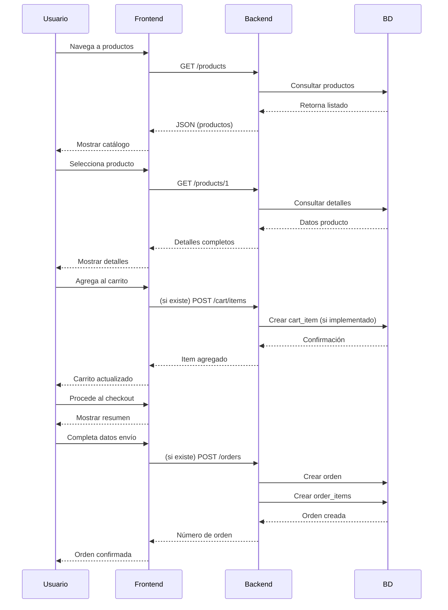
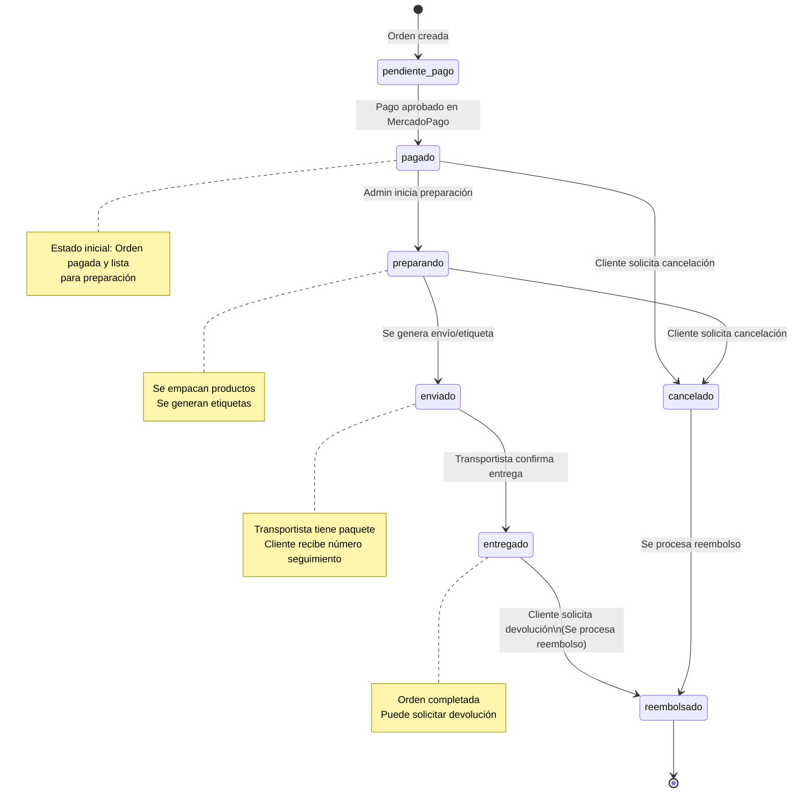
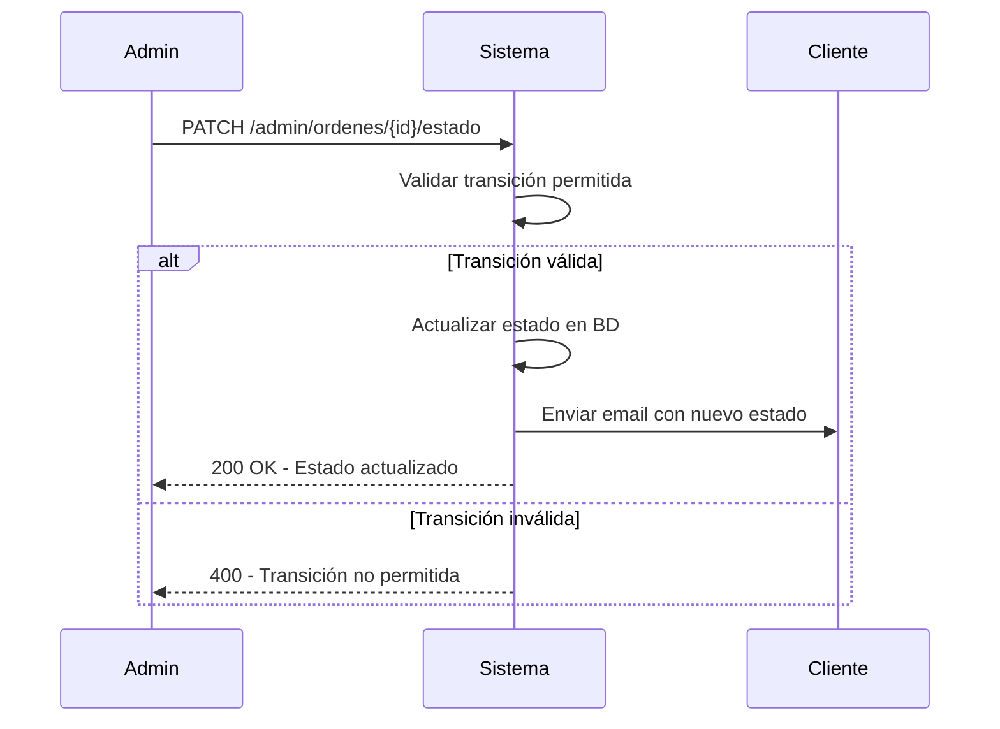
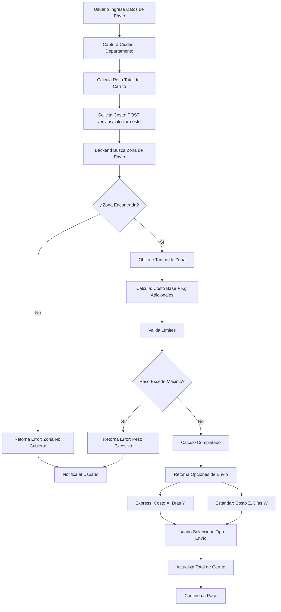
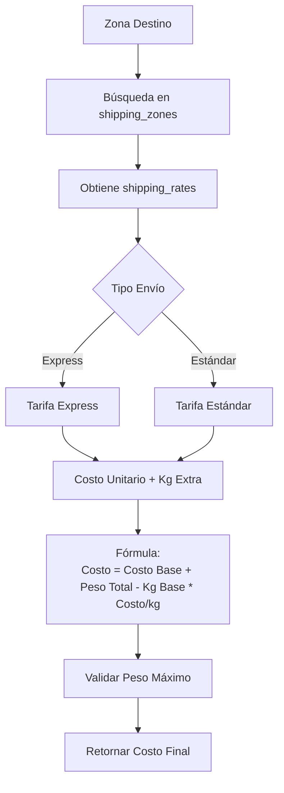
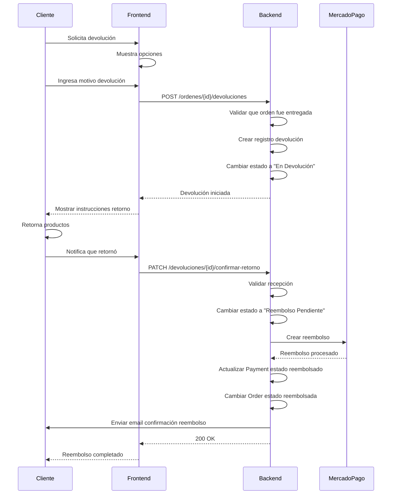
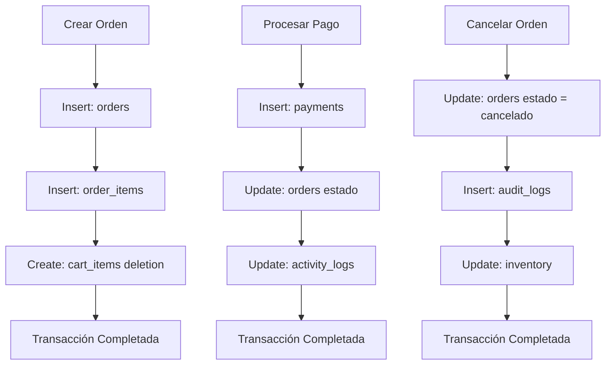

# Flujos y Procesos Críticos - IND_MAAV E-Commerce

**Versión:** 1.0  
**Última actualización:** 25 de enero de 2024

---

## Tabla de Contenidos

1. [Flujo de Registro de Usuario](#flujo-de-registro-de-usuario)
2. [Flujo de Compra](#flujo-de-compra)
3. [Flujo de Pago](#flujo-de-pago)
4. [Flujo de Cambio de Estado de Orden](#flujo-de-cambio-de-estado-de-orden)
5. [Flujo de Cálculo de Envíos](#flujo-de-cálculo-de-envíos)
6. [Flujo de Devolución y Reembolso](#flujo-de-devolución-y-reembolso)

---

## Flujo de Registro de Usuario

```mermaid
flowchart TD
    A[Usuario Accede a Registro] --> B[Completa Formulario]
    B --> C{Datos Válidos?}
    
    C -->|No| D[Mostrar Errores]
    D --> B
    
    C -->|Sí| E{Email ya Existe?}
    E -->|Sí| F[Mostrar: Email Duplicado]
    F --> B
    
    E -->|No| G[Hash Contraseña]
    G --> H[Crear Usuario en BD]
    H --> I{Creación Exitosa?}
    
    I -->|No| J[Error de Servidor]
    J --> K[Notificar Usuario]
    
    I -->|Sí| L[Generar token de acceso (Sanctum)]
    L --> M[Guardar Token en LocalStorage]
    M --> N[Enviar Email de Verificación]
    N --> O[Redirigir a Dashboard]
    O --> P[Usuario Registrado]
```

---

## Flujo de Compra



---

## Flujo de Pago

```mermaid
graph LR
    A[Orden Creada] --> B[Estado: Pendiente Pago]
    B --> C[Usuario Hace Click Pagar]
    C --> D[Frontend Solicita Preferencia]
    D --> E[Backend Crea Preferencia MP]
    E --> F[MP Retorna Preference ID]
    F --> G[Frontend Abre Checkout MP]
    G --> H{Usuario Completa Pago?}
    
    H -->|Sí| I[MP Procesa Tarjeta]
    I --> J{Pago Aprobado?}
    
    J -->|Sí| K[MP Envía Webhook IPN]
    K --> L[Backend Recibe Notificación]
    L --> M[Obtiene Detalles de Pago]
    M --> N[Actualiza Estado: Pagado]
    N --> O[Registra en Payments]
    O --> P[Envía Email Confirmación]
    P --> Q[Usuario Redirigido a Éxito]
    
    J -->|No| R[Rechaza Pago]
    R --> S[Usuario Redirigido a Error]
    S --> T[Orden Sigue Pendiente]
    T --> U{Reintentar?}
    U -->|Sí| C
    U -->|No| V[Orden Cancelada]
    
    H -->|No| W[Usuario Abandona]
    W --> T
```



---

## Flujo de Cambio de Estado de Orden



---

## Transiciones de Estado (Detallado)



---

## Flujo de Cálculo de Envíos



---

## Cálculo de Costos



---

## Flujo de Devolución y Reembolso



---

## Diagrama de Transacciones de BD



---

## Estados y Eventos de Auditoría

| Evento | Tabla | Acción | Datos Registrados |
|--------|-------|--------|-------------------|
| Usuario Registrado | users | INSERT | nombre, email, rol |
| Pago Recibido | payments | INSERT | monto, estado, referencia_mp |
| Orden Actualizada | orders | UPDATE | estado anterior, nuevo estado |
| Producto Vendido | products | UPDATE | cantidad anterior, nueva cantidad |
| Devolución Iniciada | returns | INSERT | orden_id, motivo |

---

**Última actualización:** 25 de enero de 2024
