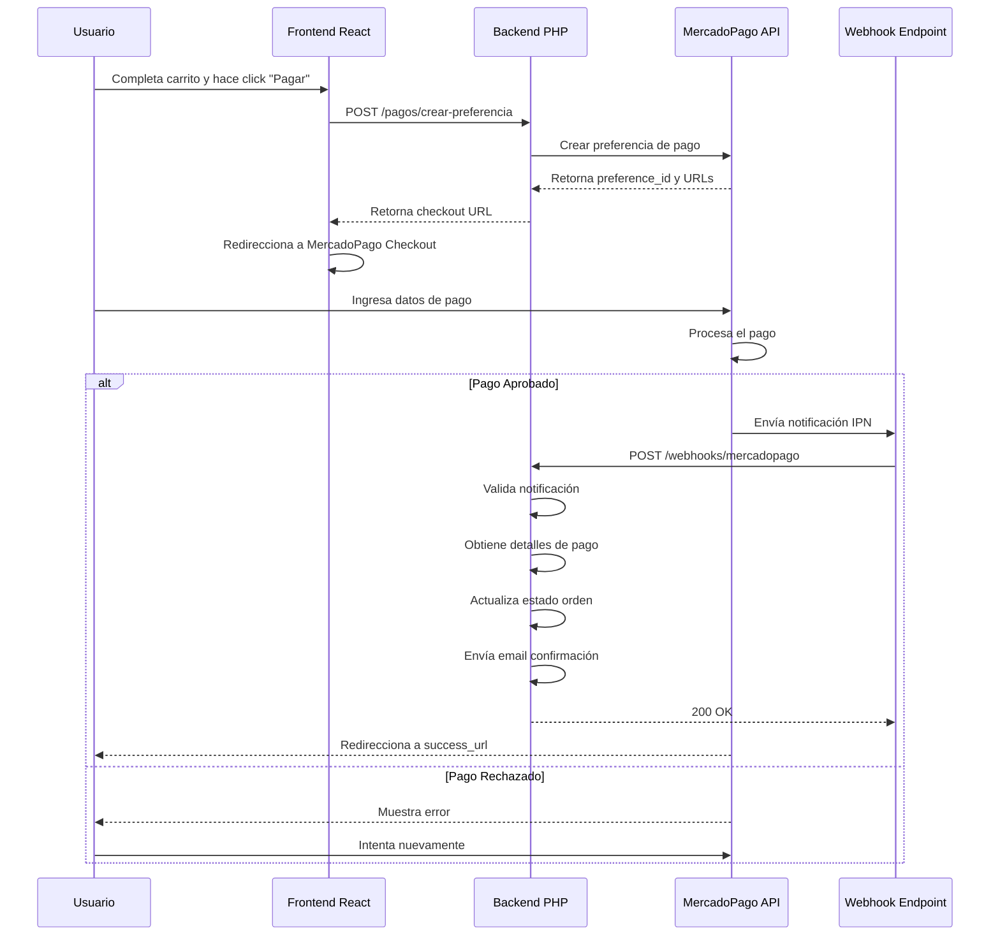
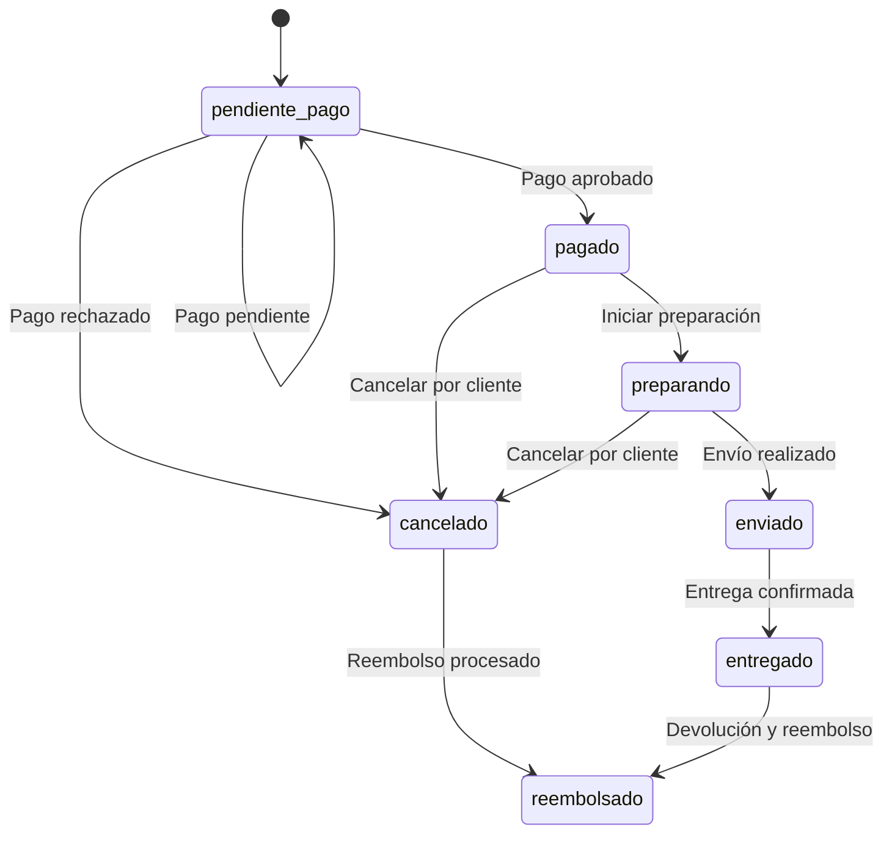

# Integración MercadoPago - IND_MAAV E-Commerce

**Versión:** 1.0  
**Última actualización:** 25 de enero de 2024

---

## Tabla de Contenidos

1. [Requisitos Previos](#requisitos-previos)
2. [Configuración Inicial](#configuración-inicial)
3. [Flujo de Pago](#flujo-de-pago)
4. [Crear Preferencia de Pago](#crear-preferencia-de-pago)
5. [Webhook IPN](#webhook-ipn)
6. [Manejo de Estados](#manejo-de-estados)
7. [Notificaciones al Cliente](#notificaciones-al-cliente)
8. [Ejemplo de Código](#ejemplo-de-código)
9. [Testing](#testing)
10. [Errores Comunes](#errores-comunes)

---

## Requisitos Previos

### 1. Cuenta en MercadoPago

1. Crear cuenta en [MercadoPago](https://www.mercadopago.com.co/)
2. Verificar identidad del vendedor
3. Agregar información bancaria para recibir pagos
4. Acceder a [Credenciales en Panel de Control](https://www.mercadopago.com.co/developers/panel)

### 2. Credenciales Necesarias

| Credencial | Descripción | Dónde Obtenerla |
|------------|-------------|-----------------|
| **Access Token** | Token de autenticación | Panel de Desarrollador > Credenciales |
| **Public Key** | Clave pública para frontend | Panel de Desarrollador > Credenciales |
| **Webhook URL** | URL para recibir notificaciones | Panel de Desarrollador > Webhooks |

### 3. SDK de MercadoPago

**PHP:**
```bash
composer require mercadopago/dx-php:^2.0
```

**JavaScript/React:**
```bash
npm install @mercadopago/sdk-js
```

---

## Configuración Inicial

### Variables de Entorno (.env)

```env
# MercadoPago
MERCADOPAGO_ACCESS_TOKEN=APP_USR_XXXXXXXXXXXXXXXXXXXXXXXXXXXX
MERCADOPAGO_PUBLIC_KEY=APP_USR_XXXXXXXXXXXXXXXXXXXXXXXXXXXX
MERCADOPAGO_MODE=production  # o 'sandbox' para pruebas
MERCADOPAGO_WEBHOOK_URL=https://api.indmaav.com/webhooks/mercadopago
```

### Configuración en Backend (PHP)

```php
<?php
// config/mercadopago.php

return [
    'access_token' => env('MERCADOPAGO_ACCESS_TOKEN'),
    'public_key' => env('MERCADOPAGO_PUBLIC_KEY'),
    'mode' => env('MERCADOPAGO_MODE', 'sandbox'),
    'sandbox' => env('MERCADOPAGO_MODE') === 'sandbox',
    'notification_url' => env('MERCADOPAGO_WEBHOOK_URL'),
];
?>
```

### Inicialización en Backend

```php
<?php
use MercadoPago\Client\Common\Request\IdempotencyRequest;
use MercadoPago\Client\Preference\PreferenceClient;
use MercadoPago\Exceptions\MPApiException;

MercadoPagoConfig::setAccessToken(config('mercadopago.access_token'));
MercadopagoConfig::setRuntimeEnviroment(config('mercadopago.mode'));
?>
```

---

## Flujo de Pago



---

## Crear Preferencia de Pago

### Endpoint Backend

**POST** `/pagos/crear-preferencia`

### Código Backend (PHP)

```php
<?php
namespace App\Http\Controllers;

use App\Models\Order;
use App\Models\Payment;
use MercadoPago\Client\Preference\PreferenceClient;
use MercadoPago\Client\Payment\PaymentClient;
use MercadoPago\Exceptions\MPApiException;
use Illuminate\Http\Request;

class PaymentController extends Controller
{
    public function crearPreferencia(Request $request)
    {
        try {
            // Validar orden
            $order = Order::findOrFail($request->orden_id);
            
            if ($order->usuario_id !== auth()->id()) {
                return response()->json([
                    'error' => 'No autorizado',
                ], 403);
            }

            // Construir items para preferencia
            $items = [];
            foreach ($order->items as $item) {
                $items[] = [
                    'id' => (string)$item->producto_id,
                    'title' => $item->nombre_producto,
                    'quantity' => $item->cantidad,
                    'unit_price' => (float)$item->precio_unitario,
                    'currency_id' => 'COP',
                    'picture_url' => $item->imagen_principal,
                ];
            }

            // Agregar envío como item
            if ($order->costo_envio > 0) {
                $items[] = [
                    'id' => 'shipping',
                    'title' => 'Costo de Envío',
                    'quantity' => 1,
                    'unit_price' => (float)$order->costo_envio,
                    'currency_id' => 'COP',
                ];
            }

            // Crear preferencia
            $client = new PreferenceClient();
            $preference = $client->create([
                'items' => $items,
                'payer' => [
                    'name' => auth()->user()->nombre,
                    'email' => auth()->user()->email,
                    'phone' => [
                        'area_code' => '57',
                        'number' => auth()->user()->telefono,
                    ],
                    'address' => [
                        'street_name' => $order->direccion_envio,
                        'zip_code' => $order->codigo_postal_envio,
                    ],
                ],
                'back_urls' => [
                    'success' => route('pagos.success'),
                    'failure' => route('pagos.failure'),
                    'pending' => route('pagos.pending'),
                ],
                'auto_return' => 'approved',
                'statement_descriptor' => 'IND-MAAV',
                'external_reference' => $order->numero_orden,
                'notification_url' => config('mercadopago.notification_url'),
                'metadata' => [
                    'order_id' => (string)$order->id,
                    'user_id' => (string)$order->usuario_id,
                ],
            ]);

            return response()->json([
                'success' => true,
                'data' => [
                    'preference_id' => $preference->id,
                    'init_point' => $preference->init_point,
                    'sandbox_init_point' => $preference->sandbox_init_point,
                ],
            ]);

        } catch (MPApiException $e) {
            \Log::error('MercadoPago Error: ' . $e->getMessage());
            return response()->json([
                'error' => 'Error al crear preferencia de pago',
                'message' => $e->getMessage(),
            ], 500);
        }
    }
}
?>
```

### Respuesta

```json
{
  "success": true,
  "data": {
    "preference_id": "1234567890",
    "init_point": "https://www.mercadopago.com/checkout/v1/redirect?pref_id=1234567890",
    "sandbox_init_point": "https://sandbox.mercadopago.com/checkout/v1/redirect?pref_id=1234567890"
  }
}
```

### Integración Frontend (React)

```javascript
import MercadoPagoCheckout from '@mercadopago/sdk-js';

export function PaymentForm({ orderId }) {
  const [preferenceId, setPreferenceId] = useState(null);
  const [loading, setLoading] = useState(false);

  const handlePago = async () => {
    setLoading(true);
    try {
      const response = await fetch('/api/v1/pagos/crear-preferencia', {
        method: 'POST',
        headers: {
          'Content-Type': 'application/json',
          'Authorization': `Bearer ${localStorage.getItem('token')}`,
        },
        body: JSON.stringify({ orden_id: orderId }),
      });

      const data = await response.json();
      
      if (data.success) {
        setPreferenceId(data.data.preference_id);
        
        // Usar MercadoPago Checkout
        const checkout = new MercadoPagoCheckout({
          preference: {
            id: data.data.preference_id,
          },
          autoOpen: true,
          onClose: () => console.log('Checkout cerrado'),
        });
      }
    } catch (error) {
      console.error('Error:', error);
      alert('Error al procesar pago');
    } finally {
      setLoading(false);
    }
  };

  return (
    <button 
      onClick={handlePago} 
      disabled={loading}
      className="bg-blue-600 text-white px-6 py-2 rounded"
    >
      {loading ? 'Procesando...' : 'Pagar con MercadoPago'}
    </button>
  );
}
```

---

## Webhook IPN

### Registro del Webhook

1. Ir a [Panel de Desarrollador > Webhooks](https://www.mercadopago.com.co/developers/panel)
2. Agregar URL: `https://api.indmaav.com/webhooks/mercadopago`
3. Seleccionar eventos a recibir:
   - `payment.created`
   - `payment.updated`
   - `charge.completed`
   - `charge.failed`
   - `charge.refunded`

### Endpoint Webhook (PHP)

```php
<?php
namespace App\Http\Controllers;

use App\Models\Order;
use App\Models\Payment;
use Illuminate\Http\Request;
use Illuminate\Support\Facades\Log;

class WebhookController extends Controller
{
    public function mercadopago(Request $request)
    {
        Log::info('MercadoPago Webhook Recibido', $request->all());

        try {
            // Validar que sea POST
            if ($request->method() !== 'POST') {
                return response()->json(['error' => 'Método no permitido'], 405);
            }

            // Obtener datos del webhook
            $data = $request->all();

            // Validar que tenga los campos requeridos
            if (!isset($data['type']) || !isset($data['data']['id'])) {
                return response()->json(['error' => 'Datos inválidos'], 400);
            }

            // Procesar notificación
            if ($data['type'] === 'payment' || $data['action'] === 'payment.created') {
                $this->procesarNotificacionPago($data['data']['id']);
            }

            return response()->json(['success' => true], 200);

        } catch (\Exception $e) {
            Log::error('Error procesando webhook MercadoPago: ' . $e->getMessage());
            return response()->json(['error' => 'Error procesando webhook'], 500);
        }
    }

    private function procesarNotificacionPago($paymentId)
    {
        try {
            // Obtener detalles de pago desde MercadoPago
            $client = new \MercadoPago\Client\Payment\PaymentClient();
            $payment = $client->get($paymentId);

            // Obtener referencia externa (número de orden)
            $numeroOrden = $payment->external_reference;
            
            if (!$numeroOrden) {
                Log::warning('No se encontró referencia externa en pago: ' . $paymentId);
                return;
            }

            // Buscar orden
            $order = Order::where('numero_orden', $numeroOrden)->first();
            
            if (!$order) {
                Log::warning('Orden no encontrada: ' . $numeroOrden);
                return;
            }

            // Crear o actualizar registro de pago
            $paymentRecord = Payment::firstOrCreate(
                ['referencia_mercadopago' => $paymentId],
                [
                    'orden_id' => $order->id,
                    'monto' => $payment->transaction_amount,
                    'metodo_pago' => 'mercadopago',
                ]
            );

            // Mapear estado de MercadoPago a nuestros estados
            $estadoMappeo = [
                'approved' => 'aprobado',
                'pending' => 'pendiente',
                'authorized' => 'pendiente',
                'in_process' => 'pendiente',
                'in_mediation' => 'pendiente',
                'rejected' => 'rechazado',
                'cancelled' => 'cancelado',
                'refunded' => 'reembolsado',
                'charged_back' => 'reembolsado',
            ];

            $estadoPago = $estadoMappeo[$payment->status] ?? 'pendiente';

            // Actualizar pago
            $paymentRecord->update([
                'estado' => $estadoPago,
                'referencia_externo' => $payment->id,
                'tipo_pago' => $payment->payment_method_id,
                'ultimos_4_digitos' => $payment->card?->last_four_digits,
                'banco' => $payment->issuer_id,
                'fecha_pago' => $payment->date_approved ? 
                    \Carbon\Carbon::parse($payment->date_approved) : null,
                'nota_error' => $payment->status_detail,
            ]);

            // Actualizar estado de orden según pago
            if ($estadoPago === 'aprobado') {
                $order->update([
                    'estado' => 'pagado',
                    'actualizado_en' => now(),
                ]);

                // Enviar email de confirmación
                $this->enviarEmailConfirmacion($order);

                // Registrar en activity logs
                activity()
                    ->performedOn($order)
                    ->withProperties(['pago_id' => $paymentRecord->id])
                    ->log('Pago procesado exitosamente');

            } elseif ($estadoPago === 'rechazado') {
                $order->update([
                    'estado' => 'cancelado',
                    'actualizado_en' => now(),
                ]);

                // Enviar email de rechazo
                $this->enviarEmailRechazo($order, $payment->status_detail);

            } elseif ($estadoPago === 'reembolsado') {
                $order->update([
                    'estado' => 'reembolsado',
                    'actualizado_en' => now(),
                ]);

                $this->enviarEmailReembolso($order);
            }

            Log::info('Notificación de pago procesada exitosamente: ' . $paymentId);

        } catch (\Exception $e) {
            Log::error('Error procesando pago: ' . $e->getMessage());
            throw $e;
        }
    }

    private function enviarEmailConfirmacion($order)
    {
        // Implementar envío de email
        $usuario = $order->usuario;
        
        $emailData = [
            'nombre' => $usuario->nombre,
            'numero_orden' => $order->numero_orden,
            'total' => number_format($order->total, 0, ',', '.'),
            'fecha' => $order->creado_en->format('d/m/Y H:i'),
            'numero_seguimiento' => $order->shipment?->numero_seguimiento,
        ];

        \Mail::send('emails.pago-confirmado', $emailData, function($m) use ($usuario) {
            $m->to($usuario->email)
              ->subject('Pago Confirmado - IND-MAAV');
        });
    }

    private function enviarEmailRechazo($order, $razon)
    {
        $usuario = $order->usuario;
        
        $emailData = [
            'nombre' => $usuario->nombre,
            'numero_orden' => $order->numero_orden,
            'razon' => $razon,
        ];

        \Mail::send('emails.pago-rechazado', $emailData, function($m) use ($usuario) {
            $m->to($usuario->email)
              ->subject('Pago Rechazado - IND-MAAV');
        });
    }

    private function enviarEmailReembolso($order)
    {
        $usuario = $order->usuario;
        
        $emailData = [
            'nombre' => $usuario->nombre,
            'numero_orden' => $order->numero_orden,
            'monto' => number_format($order->total, 0, ',', '.'),
        ];

        \Mail::send('emails.reembolso-procesado', $emailData, function($m) use ($usuario) {
            $m->to($usuario->email)
              ->subject('Reembolso Procesado - IND-MAAV');
        });
    }
}
?>
```

---

## Manejo de Estados

### Estados de Pago en MercadoPago

| Estado | Descripción | Acción |
|--------|-------------|--------|
| `approved` | Pago aprobado | Confirmar orden, enviar email |
| `pending` | Pago pendiente de aprobación | Mantener orden en espera |
| `authorized` | Pago autorizado, aún no acreditado | Esperar confirmación |
| `in_process` | En proceso de validación | Mantener en espera |
| `in_mediation` | En disputa | Notificar administrador |
| `rejected` | Pago rechazado | Cancelar orden, permitir reintentar |
| `cancelled` | Pago cancelado | Cancelar orden |
| `refunded` | Pago reembolsado | Procesar devolución |
| `charged_back` | Contracargo bancario | Notificar administrador |

### Transiciones de Estados de Orden



---

## Notificaciones al Cliente

### Email de Pago Confirmado

```html
<!DOCTYPE html>
<html>
<head>
    <meta charset="UTF-8">
    <style>
        body { font-family: Arial, sans-serif; color: #333; }
        .container { max-width: 600px; margin: 0 auto; padding: 20px; }
        .header { background: #2c3e50; color: white; padding: 20px; text-align: center; }
        .content { padding: 20px; border: 1px solid #ddd; }
        .footer { text-align: center; padding: 10px; color: #999; font-size: 12px; }
        .button { background: #27ae60; color: white; padding: 10px 20px; text-decoration: none; border-radius: 5px; }
        table { width: 100%; margin: 15px 0; }
        th, td { padding: 8px; text-align: left; border-bottom: 1px solid #ddd; }
    </style>
</head>
<body>
    <div class="container">
        <div class="header">
            <h1>¡Pago Confirmado!</h1>
        </div>
        
        <div class="content">
            <p>Hola {{ $nombre }},</p>
            
            <p>Tu pago ha sido procesado correctamente. Aquí están los detalles:</p>
            
            <table>
                <tr>
                    <th>Concepto</th>
                    <th>Valor</th>
                </tr>
                <tr>
                    <td>Número de Orden</td>
                    <td><strong>{{ $numero_orden }}</strong></td>
                </tr>
                <tr>
                    <td>Total Pagado</td>
                    <td><strong>${{ $total }} COP</strong></td>
                </tr>
                <tr>
                    <td>Fecha de Pago</td>
                    <td>{{ $fecha }}</td>
                </tr>
                <tr>
                    <td>Número de Seguimiento</td>
                    <td><strong>{{ $numero_seguimiento }}</strong></td>
                </tr>
            </table>
            
            <p>Tu orden está siendo preparada para el envío. Recibirás notificaciones sobre el estado.</p>
            
            <p style="text-align: center;">
                <a href="https://indmaav.com/ordenes/{{ $numero_orden }}" class="button">Ver Orden</a>
            </p>
            
            <p>Cualquier pregunta puedes contactarnos a través de:</p>
            <ul>
                <li>Email: soporte@indmaav.com</li>
                <li>Teléfono: +57 (1) 1234-5678</li>
                <li>Whatsapp: +57 320 1234567</li>
            </ul>
        </div>
        
        <div class="footer">
            <p>&copy; 2024 IND-MAAV. Todos los derechos reservados.</p>
        </div>
    </div>
</body>
</html>
```

---

## Ejemplo de Código

### Solución Completa: Checkout en React

```javascript
// components/CheckoutForm.jsx
import React, { useState } from 'react';
import MercadoPagoCheckout from '@mercadopago/sdk-js';
import axiosInstance from '../api/axiosConfig';

export function CheckoutForm({ order }) {
  const [loading, setLoading] = useState(false);
  const [error, setError] = useState(null);

  const procesarPago = async () => {
    setLoading(true);
    setError(null);

    try {
      // Crear preferencia en el backend
      const response = await axiosInstance.post('/pagos/crear-preferencia', {
        orden_id: order.id,
      });

      if (!response.data.success) {
        throw new Error('No se pudo crear la preferencia de pago');
      }

      const { preference_id } = response.data.data;

      // Crear instancia de Checkout
      const bricksBuilder = window.MercadoPago.Bricks();
      
      await bricksBuilder.create('wallet', {
        initialization: {
          preferenceId: preference_id,
        },
        onError: (error) => {
          setError(`Error en Checkout: ${error.message}`);
        },
      });

    } catch (err) {
      console.error('Error:', err);
      setError(err.message || 'Error al procesar el pago');
    } finally {
      setLoading(false);
    }
  };

  return (
    <div className="checkout-form">
      <h2>Resumen de Pago</h2>
      
      <div className="order-summary">
        <p>Subtotal: ${order.subtotal.toLocaleString('es-CO')}</p>
        <p>Envío: ${order.costo_envio.toLocaleString('es-CO')}</p>
        <p>IVA: ${order.impuesto_iva.toLocaleString('es-CO')}</p>
        <h3>Total: ${order.total.toLocaleString('es-CO')} COP</h3>
      </div>

      {error && <div className="error-message">{error}</div>}

      <button 
        onClick={procesarPago}
        disabled={loading}
        className="btn-pagar"
      >
        {loading ? 'Procesando...' : 'Pagar Ahora'}
      </button>

      <div id="wallet_container"></div>
    </div>
  );
}
```

---

## Testing

### Tarjetas de Prueba

**Pago Aprobado:**
- Tarjeta: `4111 1111 1111 1111`
- Mes: Cualquier mes futuro
- Año: Cualquier año futuro
- CVV: Cualquier número de 3 dígitos

**Pago Rechazado:**
- Tarjeta: `5555 5555 5555 4444`

**Pago Pendiente:**
- Tarjeta: `4509 9535 6623 7060`

### Testing del Webhook Localmente

Usar [ngrok](https://ngrok.com/) para exponer localhost:

```bash
# Instalar ngrok
npm install -g ngrok

# Ejecutar ngrok
ngrok http 8000

# Copiar URL pública y usarla como MERCADOPAGO_WEBHOOK_URL
# https://xxxx-xx-xxx-xxx-xx.ngrok.io/webhooks/mercadopago
```

---

## Errores Comunes

### Error: "Invalid access token"

**Causa:** Token inválido o expirado  
**Solución:** Verificar credenciales en panel de MercadoPago

### Error: "Preference not found"

**Causa:** ID de preferencia inválida  
**Solución:** Verificar que preference_id sea correcto

### El webhook no se dispara

**Causa:** URL no accesible o no registrada  
**Solución:**
1. Verificar que URL sea pública (usar ngrok en desarrollo)
2. Registrar webhook en panel de MercadoPago
3. Revisar logs de MercadoPago

### Pago aprobado pero orden no se actualiza

**Causa:** Error al procesar webhook  
**Solución:**
1. Verificar logs del servidor
2. Validar que endpoint retorne 200 OK
3. Revisar que external_reference sea correcto

---

**Última actualización:** 25 de enero de 2024
